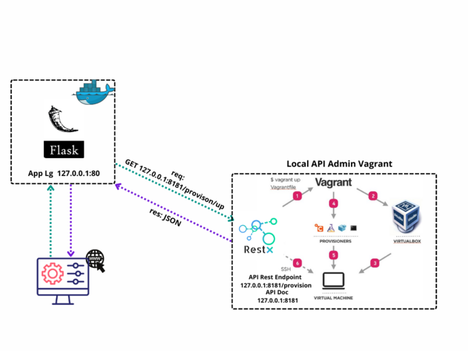
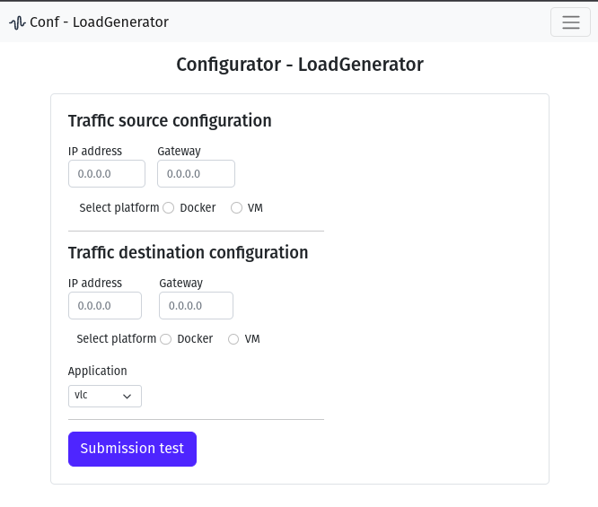
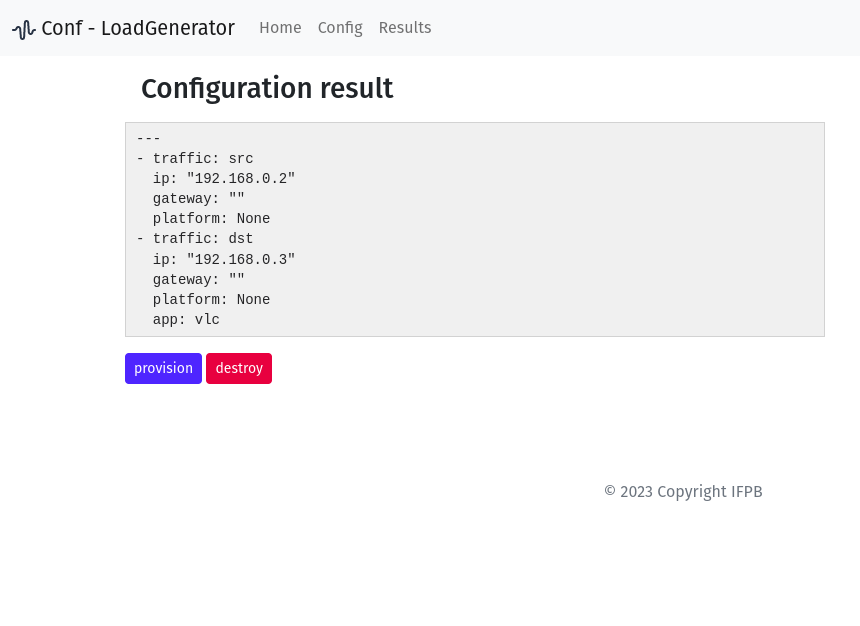
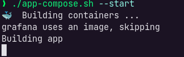
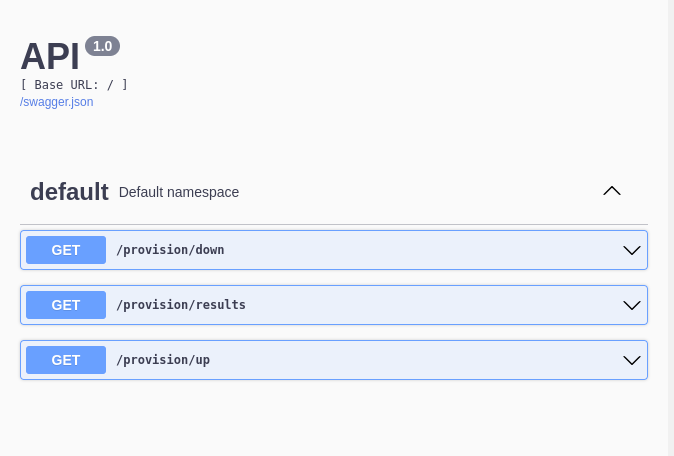

# wave
Gerador de cargas múltiplas para experimentação em redes de computadores

## Configurator WAVE 

Will be able to use it on:

- desktop

It uses:

- Python3 (Virtualenv, Flask)
- Docker (docker-compose)
- VirtualBox
- Vagrant

---

### Screenshots

Application Architecture.

Application interface. From here you can edit the configuration parameters.

---

Configuration output in yaml format. The generated file can be found in `app/provision/confg.yaml`

---

### How to run App Flask witch Docker

**Make sure you already installed dependencies**

- Dependencies:

  1.  [VirtualBox](https://www.virtualbox.org/wiki/Downloads)
  1.  [Vagrant](https://www.vagrantup.com/downloads)
  1.  [Python](https://www.python.org/download/releases)
  1.  [docker](https://www.docker.com) and [docker-compose](https://docs.docker.com/compose/install/)

2. Clone project `git clone https://github.com/pauloditarso/loadgenerator.git` in terminal after going to director lg `cd arquivos/lg`.
1. Setting up permissions in scripts `chmod +x app-compose.sh start-api.sh` file.
1. Run the script passing the tag as an argument `./app-compose.sh <option>[--start|--destroy] [host_api]` (the IP address of the API is optional) by default, the API IP address is set to the local machine.

   

1. The API will start on port 8181. Access `http://IP_API:8181` to view the API documentation.

1. Go your browser and type `http://localhost:80`